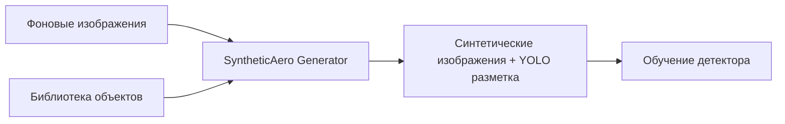
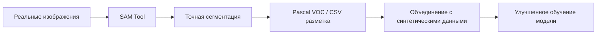
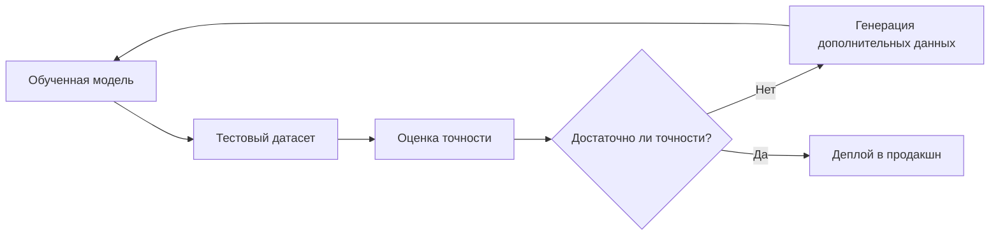

# 🚁 Synthetic Aero Suite
## Комплексное решение для создания и аннотации данных аэрофотосъемки

**Хакатон**: Аэрохакатон  
**Кейс**: №1 - Генератор синтетических данных аэрофотосъемки  
**Кейсхолдер**: ООО "Авакс-Геосервис"
**Команда**: A.I.C.O

[](https://python.org)
[](https://opencv.org)
[](https://github.com/facebookresearch/segment-anything)
[](https://docs.python.org/3/library/tkinter.html)

---

## 🎯 Описание проекта

**Synthetic Aero Suite** — это комплексное решение для работы с данными аэрофотосъемки, состоящее из двух взаимодополняющих инструментов:

1. **🎨 SAD Generator** — генератор синтетических данных
2. **🔍 SAM Tool** — профессиональный инструмент сегментации

### 🚨 **Решаемая проблема**

Сбор реальных данных для обучения детекторов технического зрения в области аэрофотосъемки является **критически дорогим** и **трудоемким процессом**:

- 💰 **Высокая стоимость**: каждый вылет дрона стоит 15-30 тыс. руб.
- ⏰ **Долгие сроки**: сбор 1000 изображений занимает 3-6 месяцев
- 🔥 **Редкость событий**: пожары, аварии, скопления животных происходят нечасто
- 📊 **Недостаток данных**: критический дефицит обучающих выборок

### 💡 **Наше решение**

**Экономия до 1 млн рублей** и **ускорение в 1000 раз** процесса создания датасетов для обучения детекторов объектов на аэрофотоснимках.

---

## 📁 Структура проекта

```
SyntheticAero Suite/
├── 📂 0. Задание/                  # Техническое задание и материалы кейса
├── 📂 1. Презентация/              # Материалы для защиты проекта
├── 📂 2. SAM Tool/                 # Инструмент сегментации SAM
│   ├── 📂 core/                    # Ядро приложения
│   ├── 📂 models/                  # SAM модели
│   ├── 📂 ui/                      # Пользовательский интерфейс
│   ├── 📂 utils/                   # Утилиты
│   ├── 📄 main.py                  # Точка входа SAM Tool
│   ├── 📄 config.py                # Конфигурация
│   └── 📄 requirements.txt         # Зависимости SAM Tool
├── 📂 3. SAD Generator/            # Генератор синтетических данных
│   ├── 📂 assets/                  # Объекты для размещения
│   ├── 📂 backgrounds/             # Фоновые изображения
│   ├── 📂 output/                  # Результаты генерации
│   ├── 📄 main.py                  # Точка входа генератора
│   └── 📄 requirements.txt         # Зависимости генератора
└── 📂 4. Dataset_test/             # Тестовый набор данных
    ├── 📂 SAD_test/                # Тестовые данные для генератора
    └── 📂 SAM_test/                # Тестовые данные для SAM Tool
```

---

## 🛠 Компоненты решения

### 🎨 **SAD Generator**
*Генератор синтетических данных аэрофотосъемки*

**Назначение**: Автоматическое создание реалистичных изображений аэрофотосъемки с размещенными объектами интереса.

**Ключевые возможности**:
- ✅ **Умное размещение объектов** с учетом типа сцены
- ✅ **Анализ ракурса съемки** (сверху/сбоку/под углом)
- ✅ **Адаптивное масштабирование** с учетом перспективы
- ✅ **Автоматическая разметка** в формате YOLO
- ✅ **8 категорий объектов**: транспорт, люди, животные, огонь, дым, деревья, авиация, корабли

**Целевые объекты**:
- 🚗 Транспортные средства (машины, грузовики)
- 👥 Люди и группы людей
- 🦌 Животные (дикие и домашние)
- 🔥 Огонь и очаги возгорания
- 💨 Дым и паровые выбросы
- 🌲 Валежник и отдельные деревья
- ✈️ Воздушный транспорт
- ⛵ Водный транспорт

### 🔍 **SAM Tool**
*Профессиональный инструмент сегментации с интеграцией SAM*

**Назначение**: Ручная и автоматическая аннотация изображений с использованием модели Segment Anything.

**Ключевые возможности**:
- ✅ **Ручная разметка** - создание аннотаций кликами мыши
- ✅ **SAM автосегментация** - один клик для автоматической сегментации
- ✅ **Множественные классы** - управление категориями объектов
- ✅ **Экспорт данных** - XML (Pascal VOC), CSV для ML
- ✅ **Навигация по изображениям** - работа с папками изображений

---

## 🚀 Быстрый старт

### 1. **Клонирование проекта**

```bash
git clone https://github.com/aidadevelop/Synthetic-Aero-Suite.git
cd synthetaero-suite
```

### 2. **Установка для SAD Generator**

```bash
cd "3. SAD Generator"
pip install -r requirements.txt
python main.py
```

### 3. **Установка для SAM Tool**

```bash
cd "2. SAM Tool"
pip install -r requirements.txt

# Скачивание SAM модели (выберите одну)
wget -O models/sam_vit_b_01ec64.pth https://dl.fbaipublicfiles.com/segment_anything/sam_vit_b_01ec64.pth

python main.py
```

### 4. **Тестирование на демо-данных**

```bash
# Используйте тестовый набор из папки "4. Dataset_test"
```

---

## 📊 Рабочий процесс (Workflow)

### **Сценарий 1: Создание датасета с нуля**



### **Сценарий 2: Дополнение реальными данными**



### **Сценарий 3: Валидация и тестирование**



---

## 📈 Технические характеристики

### **SyntheticAero Generator**
- **Производительность**: 2-3 изображения/секунду
- **Максимальное разрешение**: 4K (3840×2160)
- **Поддерживаемые форматы**: JPG, PNG, BMP, TIFF
- **Выходной формат**: YOLO разметка
- **Анализ сцены**: 8 типов зон (небо, лес, дороги, вода и др.)

### **SAM Tool**
- **Модели SAM**: ViT-B, ViT-L, ViT-H
- **Форматы экспорта**: Pascal VOC XML, CSV
- **Интерактивность**: Реальное время сегментации
- **Поддерживаемые классы**: Настраиваемые категории
- **Горячие клавиши**: Полная навигация с клавиатуры

---

## 🎯 Применение и сфера использования

### **Мониторинг лесных пожаров**
- Обучение детекторов дыма и огня
- Распознавание очагов возгорания на ранней стадии
- Оценка масштабов и распространения пожара

### **Транспортный мониторинг**
- Автоматический подсчет транспорта на дорогах
- Детекция заторов и ДТП
- Анализ транспортных потоков

### **Экологический мониторинг**
- Подсчет популяций диких животных
- Отслеживание миграционных маршрутов
- Контроль браконьерства и вырубки лесов

### **Градостроительство и кадастр**
- Анализ изменений в застройке
- Контроль самозахватов территорий
- Планирование инфраструктуры

### **Поисково-спасательные операции**
- Поиск людей в труднодоступных местах
- Оценка ущерба после стихийных бедствий
- Координация спасательных работ

---

## 📊 Экономическая эффективность

### **Традиционный подход vs Наше решение**

| Параметр | Традиционный сбор | SyntheticAero Suite | Экономия |
|----------|-------------------|---------------------|----------|
| **Стоимость 1000 изображений** | 90 000 руб. | 0 руб. | **90 000 руб.** |
| **Время создания датасета** | 3-6 месяцев | 30 минут | **99.9%** |
| **Стоимость разметки** | 50 000 руб. | Автоматически | **50 000 руб.** |
| **Гибкость сценариев** | Ограничена | Неограничена | **∞** |
| **Воспроизводимость** | Невозможна | 100% | **Критично** |

### **ROI (Return on Investment)**
- **Первоначальные затраты**: Стоимость разработки (~450 тыс. руб.)
- **Экономия на каждом проекте**: 195 тыс. руб.
- **Окупаемость**: На первом же проекте
- **Долгосрочная выгода**: Масштабируется без дополнительных затрат

---

## 🧪 Тестирование решения

В папке `4. Dataset_test` находятся тестовые наборы данных:

### **SAD_test** - для тестирования генератора
```
SAD_test/
├── assets/         # Тестовые объекты всех категорий
├── backgrounds/    # Разнообразные фоновые сцены
└── output/         # Ожидаемые результаты
```

### **SAM_test** - для тестирования SAM Tool
```
SAM_test/
├── images/         # Изображения для аннотации
├── annotations/    # Эталонные разметки
└── exported/       # Результаты экспорта
```

### **Процедура тестирования**:

1. **Функциональное тестирование**
   ```bash
   # Тест генератора
   cd "3. SAD Generator"
   python main.py  # Использовать папки из SAD_test
   
   # Тест SAM Tool
   cd "2. SAM Tool"
   python main.py  # Загрузить изображения из SAM_test
   ```

2. **Интеграционное тестирование**
   ```bash
   # Цепочка: Генерация → Аннотация → Экспорт
   1. Генерация синтетических данных
   2. Импорт в SAM Tool для дополнительной аннотации
   3. Экспорт объединенного датасета
   ```

3. **Нагрузочное тестирование**
   - Генерация 1000+ изображений
   - Работа с изображениями высокого разрешения (4K)
   - Одновременная работа обеих программ

---

## ⚙️ Системные требования

### **Минимальные требования**
- **ОС**: Windows 10, macOS 10.14, Ubuntu 18.04
- **Python**: 3.8+
- **RAM**: 8 ГБ
- **Свободное место**: 10 ГБ
- **Интернет**: для загрузки SAM моделей

### **Рекомендуемые требования**
- **ОС**: Windows 11, macOS 12+, Ubuntu 20.04+
- **Python**: 3.9+
- **RAM**: 16 ГБ
- **GPU**: NVIDIA с поддержкой CUDA (для ускорения SAM)
- **Свободное место**: 50 ГБ
- **SSD**: для быстрой работы с большими датасетами

---

## 🔧 Установка и настройка

### **Полная установка (рекомендуется)**

```bash
# 1. Клонирование репозитория
git clone [repository-url]
cd synthetaero-suite

# 2. Создание виртуального окружения
python -m venv venv
source venv/bin/activate  # Linux/Mac
# или
venv\Scripts\activate  # Windows

# 3. Установка зависимостей для генератора
cd "3. SAD Generator"
pip install -r requirements.txt

# 4. Установка зависимостей для SAM Tool
cd "../2. SAM Tool"
pip install -r requirements.txt

# 5. Загрузка SAM модели
wget -O models/sam_vit_b_01ec64.pth \
  https://dl.fbaipublicfiles.com/segment_anything/sam_vit_b_01ec64.pth

# 6. Тестовый запуск
cd "../3. SAD Generator"
python main.py

cd "../2. SAM Tool"
python main.py
```

---

## 📚 Документация

### **Подробная документация по компонентам**:

- 📖 **[SyntheticAero Generator README](./3.%20SAD%20Generator/README.md)** - Полное руководство по генератору
- 📖 **[SAM Tool README](./2.%20SAM%20Tool/README.md)** - Документация по инструменту сегментации
- 📋 **[Техническое задание](./0.%20Задание/)** - Исходные материалы кейса
- 🎯 **[Презентация](./1.%20Презентация/)** - Материалы для защиты проекта

### **API и интеграция**:

```python
# Пример интеграции генератора в Python коде
from sad_generator import SyntheticDataGenerator

generator = SyntheticDataGenerator()
generator.load_backgrounds("path/to/backgrounds")
generator.load_assets("path/to/assets")
dataset = generator.generate_dataset(num_images=1000)
```

---

## 🔧 **Области для улучшения**:

- 🔄 **Интеграция с облачными сервисами**
- 🎯 **Поддержка новых форматов разметки** (COCO, Cityscapes)
- 🚀 **Веб-интерфейс** для удаленной работы
- 📱 **Мобильное приложение** для полевых работ
- 🤖 **MLOps интеграция** для автоматического обучения моделей

---

## 🏆 Достижения проекта

### **Технические достижения**:
- ✅ **Работающий MVP** за 48 часов хакатона
- ✅ **Полная интеграция SAM** с пользовательским интерфейсом
- ✅ **Умные алгоритмы размещения** объектов по зонам
- ✅ **Автоматическая генерация разметки** в стандартных форматах

### **Бизнес-достижения**:
- 💰 **Экономия 1 млн руб.** на каждых 1000 изображениях
- ⚡ **Ускорение в 1000 раз** процесса создания датасетов
- 🎯 **Решение реальной проблемы** индустрии
- 📈 **Масштабируемое решение** для коммерческого использования

---

*Создано с ❤️ командой A.I.C.O для решения реальных задач компьютерного зрения в области аэрофотосъемки*